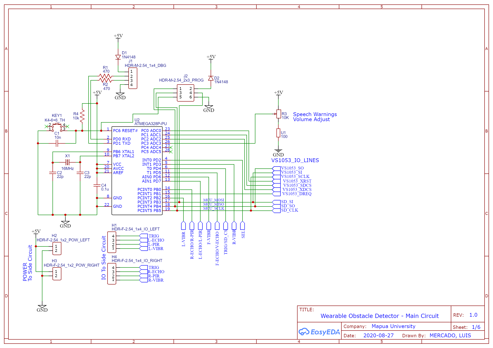
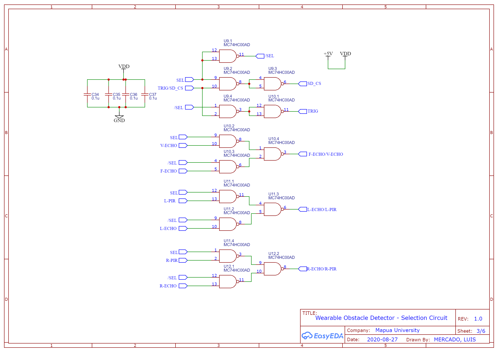
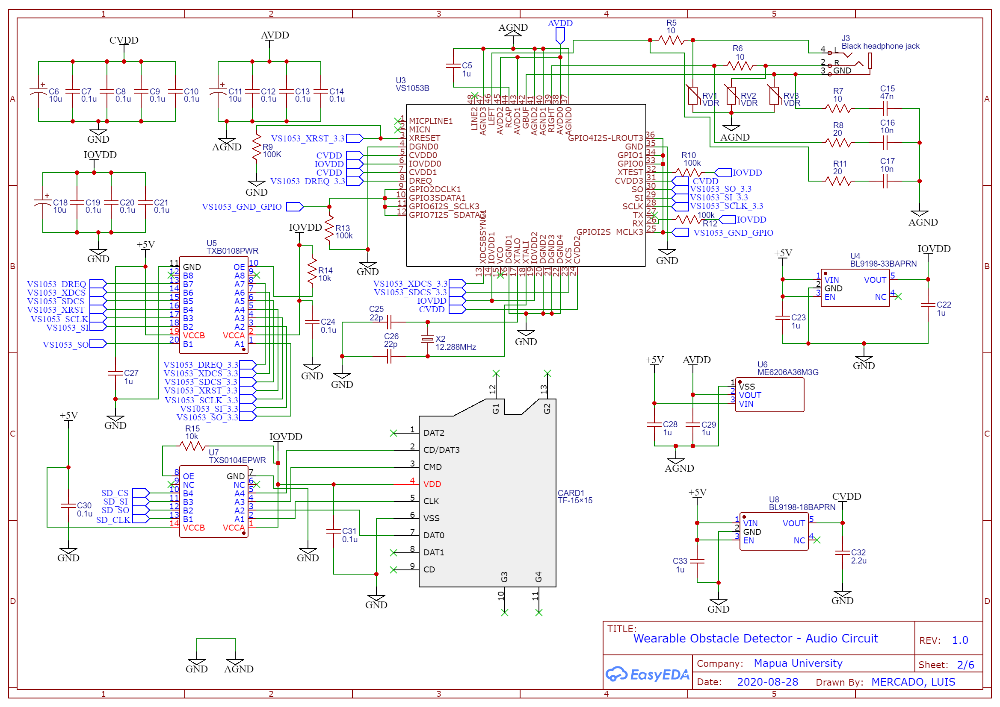
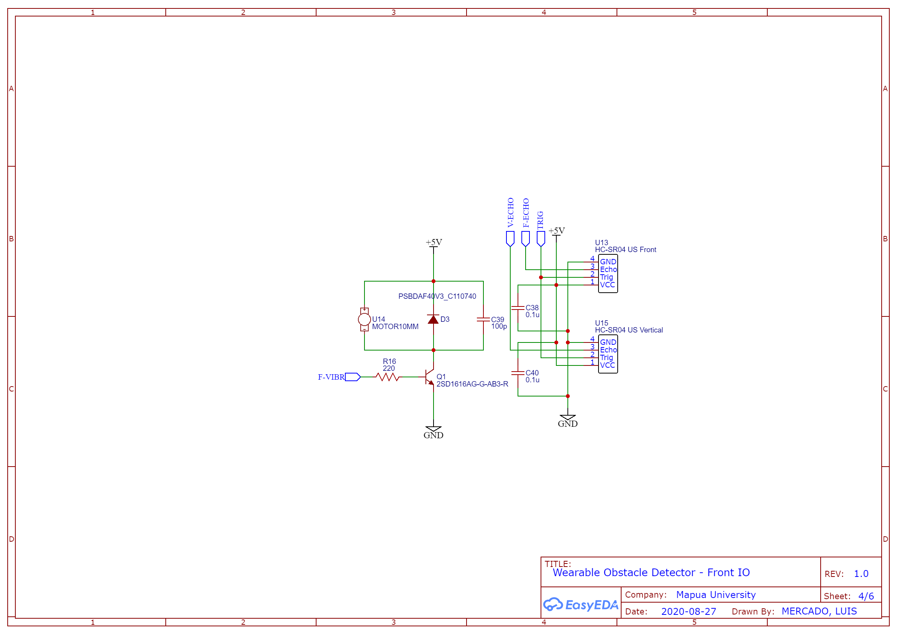
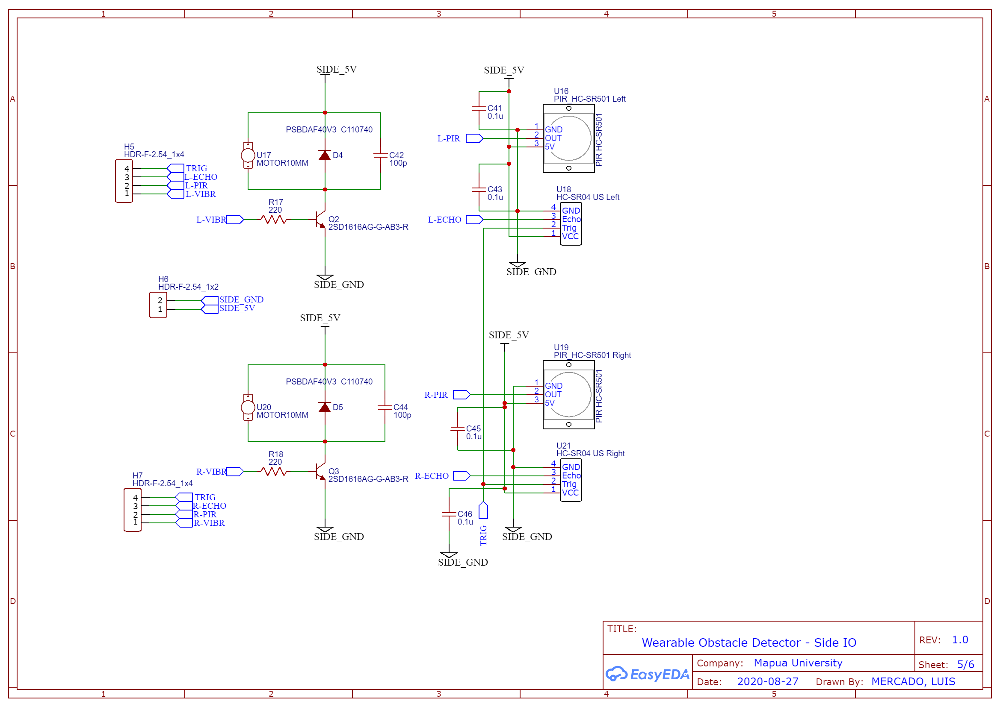
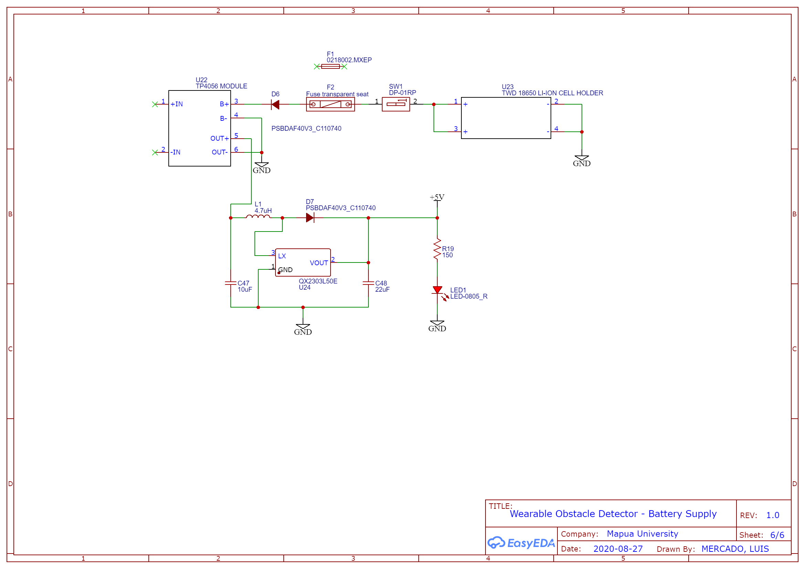

# Assistive Wearable Obstacle Detection System using Atmega328P
 Software part of the design entitled "Assistive Wearable Obstacle Detection System For The Visually Impaired Using The Atmega328p Microcontroller". This makes use of the Arduino platform to achieve the design's objectives, mainly:
- To detect potential causes of collisions and provide the wearer information about objects and people in proximity through haptic feedback and auditory warnings.
- To use the ATmega328 Microcontroller as the microcontroller for the design project.
- To determine the effectivity of the device in detecting different types of obstacles.

## Resources used
- <a href="https://freesound.org/people/LittleRainySeasons/sounds/335587/">FreeSound for startup SFX</a>
- <a href="https://texttospeech.io/">texttospeech.io for speech warnings</a>
- <a href="https://easyeda.com/editor">EasyEda for schematic and PCB design</a>

# Prototype

# Circuit Diagram
## Main Circuit (MCU)

## Main Circuit (Selection Circuit)

## Main Circuit (Audio Playback)

## Front IO

## Side IO

## Power Supply

<a href="https://drive.google.com/file/d/1RXgFMdHyPEx1-0Jna9kpo0OBlRs3VRfO/view?usp=sharing"><b>BOM and Associated Costs</b></a>
